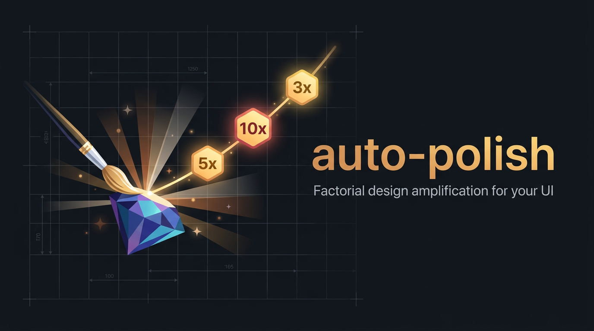

[](https://skills.sh/Shavy72/auto-polish-skill)


# auto-polish

A [Claude Code](https://claude.com/claude-code) skill that turns the final design polish of any
UI/frontend build into a **fixed, multi-agent amplification pipeline** — and that first puts
**your entire installed design arsenal** on the table instead of quietly using the same two skills
every time.

## Quickstart

```
npx skills add Shavy72/auto-polish-skill
```

## The two problems it solves

1. **Good skills sit unused.** You install great design skills and Claude keeps reaching for its
   favourites. auto-polish scans your whole setup — skills, MCP servers, plugins, AI CLIs — and
   puts every design-capable one to work.
2. **Claude never combines them.** Left alone it applies one aesthetic lens, never several in
   service of a factorial jump. Here it is forced to, and you never have to remember which of your
   skills would have been the right one for this job.

## How it works

**Phase 0 — arsenal discovery + picker.** A dependency-free Node scan reads every skill's
frontmatter, your MCP config, plugins and PATH, classifies what is design-capable, and enriches each
entry once with a concrete "specialised in …" line. The result opens as a local picker page where
**everything is pre-selected** and you deselect what does not fit this job. Tools that need you in
the loop (logins, paid steps) are flagged. Your selection returns through any of three channels:
a local endpoint, a copy-paste token, or a downloaded JSON.

**Phase 1 — 5x, parallel worlds.** The selected tools are cut into 3–6 coherent bundles, and every
bundle builds a **real, runnable variant** in its own worktree. Build green, desktop shot, mobile
shot — and a video for anything animated, because screenshots prove nothing about motion.

**Merge.** A judge panel plus external AI tutors (Codex, Gemini — with images, not just code) pick
the variant with the strongest *structure* as the base, then list every other world's strengths as
transplants. Each is grafted in and made compatible with the base's material language, or rejected
with a reason. The transplant table ships in the final report.

**Phase 2 — 10x, condensed.** No more fan-out: only the bundles that demonstrably won continue. Same
improvement brief, applied harder. Then a minimalist judge hunts for what to *remove*.

**Phase 3 — +3x.** Final jumps plus every rollback from the removal list, then strict acceptance
across desktop, mobile, motion and code.

**Improvement gate.** The factors are not arithmetic — they are the same improvement brief sent
through the system repeatedly. A quota per stage plus a blind before/after "same league or a
different league?" verdict stops alibi rounds; a missed gate gets one retry and is otherwise
declared openly.

Born from a real production session where "make this update button 5x better, look at it,
then 10x, then calculate one more 3x jump" produced dramatically better UI than a single
polish pass — and where a missed button-label critique taught the skill that copy is a
first-class design dimension.

## Installation

### Option 1 — skills CLI

```
npx skills add Shavy72/auto-polish-skill
```

Global install (available in every project):

```
npx skills add -g Shavy72/auto-polish-skill
```

### Option 2 — Claude Code plugin

```
/plugin marketplace add Shavy72/auto-polish-skill
/plugin install auto-polish@auto-polish-skill
```

### Option 3 — manual

```
git clone https://github.com/Shavy72/auto-polish-skill ~/.claude/skills/auto-polish
```

A manual copy needs `SKILL.md`, `scripts/` and `reference/` together:

```
~/.claude/skills/auto-polish/SKILL.md
~/.claude/skills/auto-polish/scripts/scan-arsenal.mjs
~/.claude/skills/auto-polish/scripts/picker.mjs
~/.claude/skills/auto-polish/reference/design-basis.md
```

To make it fire automatically, add a one-liner to your auto-active skills list in
`~/.claude/CLAUDE.md`, e.g.:

> **auto-polish** — mandatory end phase after every new UI/frontend build: workflow
> 5x → judge → 10x → judge → +3x with resource inventory + desktop/mobile/video gates.
> Mini-addons (<~30 lines) on demand only.

## Requirements

- Claude Code with multi-agent orchestration (the `Workflow`/`Agent` tools)
- **Node ≥18** for the two scripts — no npm install, no dependencies, works on
  Windows/macOS/Linux
- Playwright available via `npx` for screenshots/video (installed on demand)
- Optional but recommended: external CLI models for the tutor round (OpenAI Codex CLI,
  Google Gemini CLI), a video-analysis MCP for motion review, a browser MCP for live acceptance

## Scripts

| Script | Purpose |
|---|---|
| `scripts/scan-arsenal.mjs` | Scans skills/MCPs/plugins/CLIs → `inventory.json`. `--force` rescans everything, results are mtime-cached. |
| `scripts/picker.mjs` | Renders the picker page and runs the local return channel → `selection.json`. `--goal`, `--serve`, `--lang de\|en`, `--port`, `--timeout`. |

Both are safe to run standalone:

```
node scripts/scan-arsenal.mjs
node scripts/picker.mjs --goal "more modern and more premium" --serve
```

The server binds `127.0.0.1` only and accepts exactly two routes: `GET /` (the page) and
`POST /save` (your selection).

## Philosophy

- **Radical first, targeted second** — build parallel worlds in practice, then merge the winners.
  Comparing real results beats reasoning about which approach *should* be best.
- **Nothing gets forgotten** — every selected tool lands in exactly one bundle, and the final report
  lists what went unused and why.
- **Fixed stages, no open end** — predictable cost, proven dramaturgy.
- **Copy is design** — button labels and microcopy get audited as hard as pixels.
- **Done means done** — no half stages; proof (build, screenshots, video) or it didn't happen.

This file is meant to be fine-tuned continuously in use. PRs and forks welcome.

## License

MIT — see [LICENSE](LICENSE).
